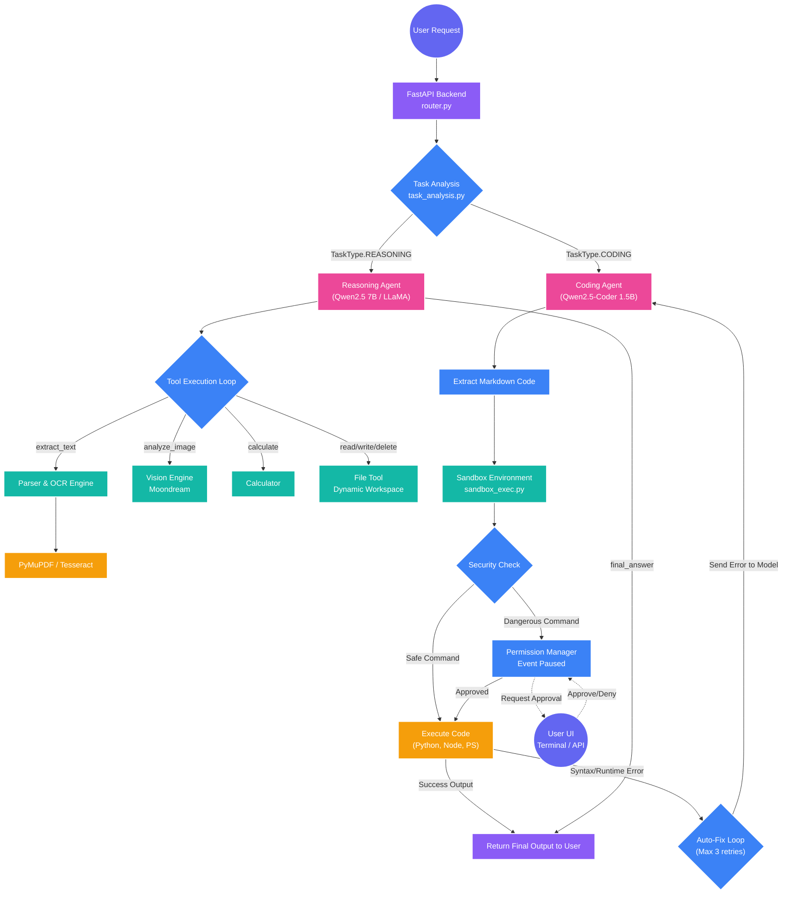

# Vajra Architecture (Current State)

Here is a visual flowchart representation of everything we have successfully integrated and built into the Vajra ecosystem up to this point.

### Key Highlights from the Flowchart:
- **Intelligent Routing:** The backend analyzes the task and routes complex reasoning to the large model, and code generation to the smaller, specialized coder model.
- **Vision & OCR (M1/M3):** The Reasoning Agent has full access to the production-grade PyMuPDF/Tesseract text extractor and your teammate's Moondream vision engine.
- **The Coding Loop (M4/Scenario B):** The Coding agent operates in a closed loop. It generates code, the Sandbox executes it in the dynamic workspace, and if it fails, it auto-heals itself up to 3 times.
- **Security Check:** The `PermissionManager` acts as the critical barrier between the Sandbox and Execution, capable of freezing the agent until you provide explicit approval.
